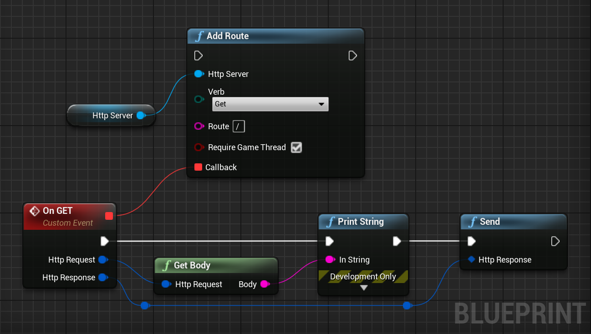

# Blueprints
This section contains examples for Blueprints on how to use the plugin.

## Creating an HTTP Server
To create an HTTP Server, call the `Create HTTP Server` node. Make sure to
store the result in a variable to prevent it from 
being garbage collected.  

## Creating an HTTPS Server
To create an HTTPS Server, call the `Create HTTPS Server` node.  
This node takes 4 parameters:
1. **Cert Path**: The location of the certificate for our HTTPS server on disk.
2. **Private Key Path**: The location of the private key for our HTTPS Server on disk.
3. **Client Ca Cert File Path**: An optional client CA file.
4. **Client Ca Cert Dir Path**: An optional location where the server should look for CA files.  

## Listening for a Route
You can listen for a route with the `Add Route` node.  
This node takes 4 parameters:
1. **Verb**: The verb of the route.
2. **Route**: The route where we want to listen. If your server is located at `127.0.0.1:8080` and you
set this parameter to `/some/route/`, the full route's URL will be `127.0.0.1:8080/some/route/`.  
Note that this parameter supports regular expressions for route matching.
3. **Require Game Thread**: If we want to execute the callback on the Game Thread or not.  
It might be intersting to set it to false for performance reasons. Not having to switch to Game
Thread to execute the callback allows to win several milliseconds.
4. **Callback**: The callback executed whenever a client try to access this route.

!> You can't create/destroy UObjects outside of the Game Thread without risking a crash.

## Getting the Request's Body

## Serving static Files
To serve static files, just call the `Add Mount Point` node.  

## Starting the Server
Once your routes are configured, call the `Listen` node to start the server.  

## Full Example
With all the previous examples assembled, we arrive to the following result:  

If you run this code, you can now open any browser and open the page `https://localhost:8080/`. The following page will show up:  

